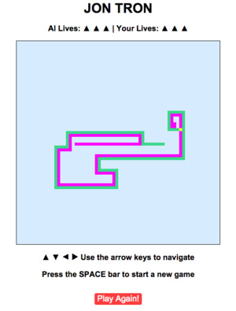

# Jon Tron

[Live](http://www.jon-tron.com)

## How to Play

You are the green line. Try to get your opponent to hit a wall before you do!
▲ ▼ ◀ ▶ Use the arrow keys to navigate your light cycle!
Use SPACE to restart the game!

You have 3 lives. If you go out of bounds or hit a wall, you will lose a life.

## Technologies

The game is written with JavaScript and jQuery.

## Implementation Details

### AI

The AI uses multiple strategies depending on the space it is confined to and what its current options are.

[Wall Hugs][wall-hugs]
Most of the time, it will try to hug a wall if it can. It identifies if any of it's three options are viable wall hugs, and if so, it will make that move. A viable wall hug was defined as a grid square adjacent to a light cycle path or any edge of the board with at least one open square.

[Area Calculation][area-calculation]
The AI also calculates the area associated with each of it's three options and will avoid making any turns associated with smaller areas.

The AI was also designed to randomly eschew these strategies and make random moves. The goal here was to make the AI more enjoyable to play against and also to sometimes sequester the other player to one part of the board.

[area-calculation]: https://github.com/jon-elofson/jon-tron/blob/master/js/ai.js#L178
[wall-hugs]: https://github.com/jon-elofson/jon-tron/blob/master/js/ai.js#L147

## TODO

  * Improve AI's space calculation algorithm
  * Add boosts so the light cycles can speed up
  * Implement multiple levels with increasingly smarter AIs
